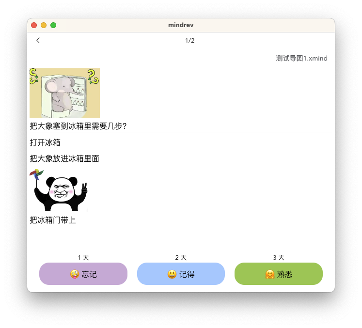
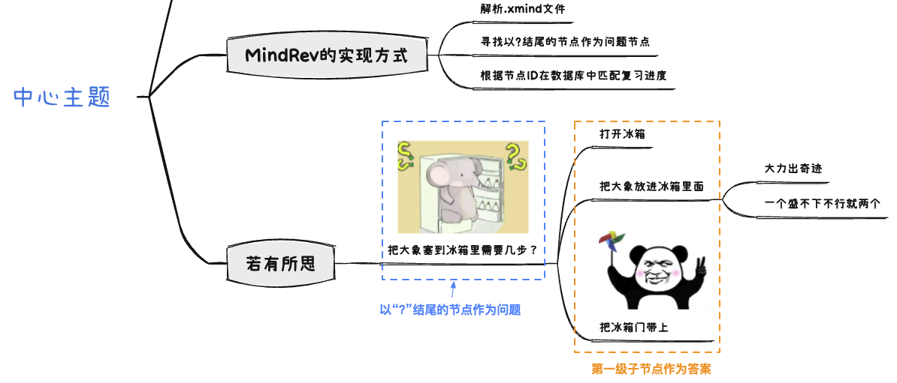

# MindRev

MindRev是复习思维导图的工具，目前仅支持XMind与iThoughtsX，它会读取导图中所有以问号“?”结尾的节点并将其作为“问题”，它的第一级子节点会作为答案:


使用教程：[腾讯文档](https://docs.qq.com/doc/DRmJwSEJ4b2NITEd6?_t=1694956653354&u=7ecb3819af254f03b32de93bf3bcc957)


### 开发调试
```
npm run serve_desk
```

### 打包
```
npm run build_mac
# or
npm run build_win
```
